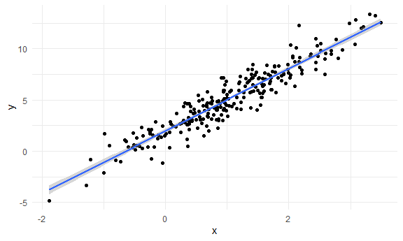
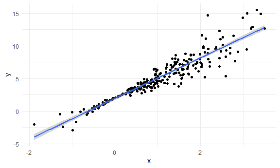

Bootstrapping
================

To bootstrap, one draws repeated samples (with the same sample size)
from the original sample with replacement to mimic the process of
drawing repeated samples from the population.

## Simulate data

``` r
#error extract from a normal distribution
n_samp = 250
sim_df_const = 
  tibble(
    x = rnorm(n_samp, 1, 1),
    error = rnorm(n_samp, 0, 1),
    y = 2 + 3 * x + error
  )

# when x close to zero, there is no error
sim_df_nonconst = 
  sim_df_const %>% 
  mutate(
    error = error * .75 * x,
    y = 2 + 3 * x + error
  )
```

**Plot the datasets** These datasets have roughly the same overall
variance, but the left panel shows data with constant variance and the
right panel shows data with non-constant variance. For this reason,
ordinary least squares should provide reasonable estimates in both
cases, but inference is standard inference approaches may only be
justified for the data on the left.

``` r
sim_df_const %>% 
  ggplot(aes(x = x, y = y)) + 
  geom_point() + 
  geom_smooth(method = "lm")
```

    ## `geom_smooth()` using formula 'y ~ x'



``` r
sim_df_nonconst %>% 
  ggplot(aes(x = x, y = y)) + 
  geom_point() + 
  geom_smooth(method = "lm")
```

    ## `geom_smooth()` using formula 'y ~ x'



``` r
# Despite the very different error structures, standard errors for coefficient estimates are similar in both cases!
lm(y ~ x, data = sim_df_const) %>% broom::tidy()
```

    ## # A tibble: 2 x 5
    ##   term        estimate std.error statistic   p.value
    ##   <chr>          <dbl>     <dbl>     <dbl>     <dbl>
    ## 1 (Intercept)     1.98    0.0981      20.2 3.65e- 54
    ## 2 x               3.04    0.0699      43.5 3.84e-118

``` r
lm(y ~ x, data = sim_df_nonconst) %>% broom::tidy()
```

    ## # A tibble: 2 x 5
    ##   term        estimate std.error statistic   p.value
    ##   <chr>          <dbl>     <dbl>     <dbl>     <dbl>
    ## 1 (Intercept)     1.93    0.105       18.5 1.88e- 48
    ## 2 x               3.11    0.0747      41.7 5.76e-114

## Draw one bootstrap sample

generate our bootstrap samples. This function should have the data frame
as the argument, and should return a sample from that dataframe drawn
with replacement.

``` r
# sample_frac() draw a particular proportion of your data set, the default sample size is same as the data frame(n=250) 
# the result is a new data frame with sample size=250
# arrange the result according to x
boot_sample = function(df) {
  
  sample_frac(df, replace = TRUE) %>% 
    arrange(x)
}
```

Check if this works .. In comparison with the original data, the
bootstrap sample has the same characteristics but isn’t a perfect
duplicate – some original data points appear more than once, others
don’t appear at all

``` r
boot_sample(sim_df_nonconst) %>% 
  ggplot(aes(x = x, y = y)) + 
  geom_point(alpha = .3) + 
  geom_smooth(method = "lm") + 
  ylim(-5, 16)
```

    ## `geom_smooth()` using formula 'y ~ x'


``` r
# instead doing plot, i could fit lm(y against x) 
boot_sample(sim_df_nonconst) %>% 
  lm(y ~ x, data = .) %>% 
  broom::tidy()
```

    ## # A tibble: 2 x 5
    ##   term        estimate std.error statistic   p.value
    ##   <chr>          <dbl>     <dbl>     <dbl>     <dbl>
    ## 1 (Intercept)     1.90    0.0982      19.3 2.45e- 51
    ## 2 x               3.14    0.0688      45.6 1.18e-122

## Many samples and analysis

``` r
#rerun boot_sample() function 1000 times, every time you will get a data frame with 250 sample size, totall 1000 data frame
# result is saved as data frame in strap_sample column, list column
boot_straps = 
  tibble(
    strap_number = 1:1000,
    strap_sample = rerun(1000, boot_sample(sim_df_nonconst))
  )
```

Can I run my analysis on these…?

``` r
# map across strap_sample column with the function lm(); fit a linear model to the 1000 data frame, get 1000 linear models
# map across each linear model in 'models' column with function broom::tidy get a new column consist of 1000 data frame
#unest(), each data frame in the new column has two row, if you unest, you finally get 2000 raws
# finally we get intercept and slop for each dataset

boot_results = 
  boot_straps %>% 
  mutate(
    models = map(strap_sample, ~lm(y ~ x, data = .x) ),
    results = map(models, broom::tidy)) %>% 
  select(-strap_sample, -models) %>% 
  unnest(results)
```

What do I have now?

``` r
# we only interest in estimate intercept and slop, not std.error, statistic, p.value
boot_results %>% 
  group_by(term) %>% 
  summarize(
    mean_est = mean(estimate),
    sd_est = sd(estimate)
  )
```

    ## `summarise()` ungrouping output (override with `.groups` argument)

    ## # A tibble: 2 x 3
    ##   term        mean_est sd_est
    ##   <chr>          <dbl>  <dbl>
    ## 1 (Intercept)     1.93 0.0748
    ## 2 x               3.11 0.101

Look at the distributions

``` r
# under repeated sampling, this is the distribution of estimated slop
boot_results %>% 
  filter(term == "x") %>% 
  ggplot(aes(x = estimate)) +
  geom_density()
```


Construct bootstrap CI

``` r
boot_results %>% 
  group_by(term) %>% 
  summarize(
    ci_lower = quantile(estimate, 0.025),
    ci_upper = quantile(estimate, 0.975)
  )
```

    ## `summarise()` ungrouping output (override with `.groups` argument)

    ## # A tibble: 2 x 3
    ##   term        ci_lower ci_upper
    ##   <chr>          <dbl>    <dbl>
    ## 1 (Intercept)     1.79     2.08
    ## 2 x               2.91     3.31

## Bootstrap using modelr

Can we simplify anything …? using the bootstrap function instead of our
own process for drawing samples with replacement.

``` r
# bootstrp(): 1000 samples, each with sample size of 250; replace column name 'id' with "strap_number'
boot_straps2 = sim_df_const %>% 
  bootstrap(1000, id = "strap_number") %>% 
  mutate(
    models = map(.x = strap, ~lm(y ~ x, data = .x)), 
    results = map(models, broom::tidy)
  ) %>% 
  select(strap_number, results) %>% 
  unnest(results) %>% 
  group_by(term) %>% 
  summarize(
    mean_est = mean(estimate),
    sd_est = sd(estimate)
  )
```

    ## `summarise()` ungrouping output (override with `.groups` argument)

For a simple linear regression, we can show the fitted lines for each
bootstrap sample(total 1000) to build intuition for these results.

``` r
boot_straps %>% 
  unnest(strap_sample) %>% 
  ggplot(aes(x = x, y = y)) + 
  geom_line(aes(group = strap_number), stat = "smooth", method = "lm", se = FALSE, alpha = .1, color = "blue") +
  geom_point(data = sim_df_nonconst, alpha = .5)
```

    ## `geom_smooth()` using formula 'y ~ x'


## Revisit nyc airbnb

``` r
data("nyc_airbnb")
nyc_airbnb = 
  nyc_airbnb %>% 
  mutate(stars = review_scores_location / 2) %>% 
  rename(
    borough = neighbourhood_group,
    neighborhood = neighbourhood) %>% 
  filter(borough != "Staten Island") %>% 
  select(price, stars, borough, neighborhood, room_type)
```

``` r
nyc_airbnb %>% 
  ggplot(aes(x = stars, y = price)) + 
  geom_point()
```

    ## Warning: Removed 9962 rows containing missing values (geom_point).


*some large outliers in price might affect estimates and inference for
the association between star rating and price. *estimates are likely to
be sensitive to those outliers and “usual” rules for inference may not
apply, the code chunk below uses the bootstrap to examine the
distribution of regression coefficients under repeated sampling.

``` r
# fit linear model to each bootstrap sample(total 1000)
airbnb_boot_results = 
  nyc_airbnb %>% 
  filter(borough == "Manhattan") %>% 
  drop_na(stars) %>% 
  bootstrap(1000, id = "strap_number") %>% 
  mutate(
    models = map(.x = strap, ~lm(price ~ stars, data = .x)), 
    results = map(models, broom::tidy)
  ) %>% 
  select(strap_number, results) %>% 
  unnest(results) 

airbnb_boot_results %>% 
  group_by(term) %>% 
  summarize(
    mean_est = mean(estimate),
    sd_est = sd(estimate)
  )
```

    ## `summarise()` ungrouping output (override with `.groups` argument)

    ## # A tibble: 2 x 3
    ##   term        mean_est sd_est
    ##   <chr>          <dbl>  <dbl>
    ## 1 (Intercept)    -35.0  31.3 
    ## 2 stars           43.4   6.34

This distribution has a heavy tail extending to low values**(left
skewed)** and a bit of a “shoulder”, features that may be related to the
frequency with which **large outliers** are included in the bootstrap
sample Compare this to `lm`

``` r
nyc_airbnb %>% 
  filter(borough == "Manhattan") %>% 
  drop_na(stars) %>% 
  lm(price ~ stars, data = .) %>% 
  broom::tidy()
```

    ## # A tibble: 2 x 5
    ##   term        estimate std.error statistic  p.value
    ##   <chr>          <dbl>     <dbl>     <dbl>    <dbl>
    ## 1 (Intercept)    -34.3     22.9      -1.50 1.35e- 1
    ## 2 stars           43.3      4.78      9.07 1.39e-19

``` r
# not normal distribution but left skewed
airbnb_boot_results %>% 
  filter(term == "stars") %>% 
  ggplot(aes(x = estimate)) + 
  geom_density()
```


