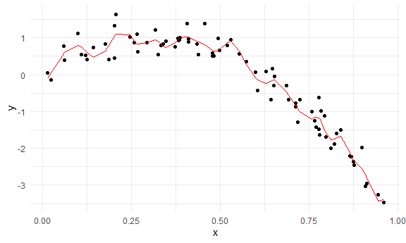
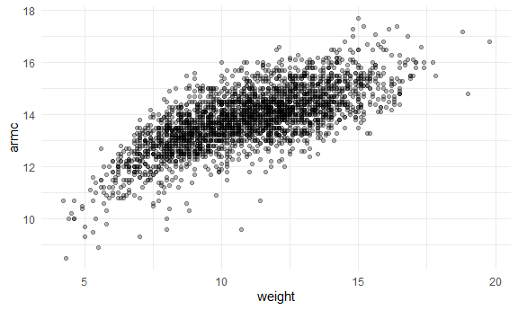
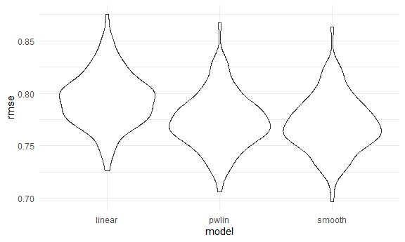

Cross Validation
================

is a resampling procedure used to evaluate machine learning models on a
limited data sample. is used to estimate the skill of a machine learning
model on unseen data. how the model is expected to perform in general
when used to make predictions on data not used during the training of
the model.  
k refers to the number of groups that a given data sample is to be split
into Implement cross validation to **assess the predictive value** of a
model using tools for iteration full data will be split the we build
model training is data you use to build model testing is data you use to
evaluate out-of-sample fit

## 1.Simulate data

``` r
# creat a non linear model
nonlin_df = 
  tibble(
    id = 1:100,
    x = runif(100, 0, 1),
    y = 1 - 10 * (x - .3) ^ 2 + rnorm(100, 0, .3)
  )
```

Look at the data:

``` r
#you could not fit a line cross the data, so our goal is to fit a line by cross validation
nonlin_df %>% 
  ggplot(aes(x = x, y = y)) + 
  geom_point()
```


## 2\. Cross validation – by hand

**Get training and testing datasets** \* split this data into training
and test sets (using anti\_join\!\!), and replot showing the split. Our
goal will be to use the training data (in black) to build candidate
models, and then see how those models predict in the testing data (in
red).

``` r
# get a fix number(80 rows) by sample_n() from nonlin_df
# then anti_join(), get data from nonlin_df and that not in train_df
train_df = sample_n(nonlin_df, size = 80)
test_df = anti_join(nonlin_df, train_df, by = "id")
```

**Fit three models**

``` r
# lm() y against x
# gam() y is a smooth function of x
# 
linear_mod = lm(y ~ x, data = train_df)
smooth_mod = gam(y ~ s(x), data = train_df)
wiggly_mod = gam(y ~ s(x, k = 30), sp = 10e-6, data = train_df)

#add_prediction(): add a column of fitted value

train_df %>% 
  add_predictions(wiggly_mod) %>% 
  ggplot(aes(x = x, y = y)) + 
  geom_point() +
  geom_line(aes(y = pred), color = "red")
```



show the three model in one plot \* the linear model is too simple and,
no matter what training data we use, will never capture the true
relationship between variables, it will be consistently wrong due to its
simplicity, and is therefore biased. \* The wiggly fit, on the other
hand, is chasing data points and will change a lot from one training
dataset to the the next – it will be consistently wrong due to its
complexity, and is therefore highly variable. Both are bad\!

``` r
# gather_predictions() is in modelr package
train_df %>% 
  gather_predictions(linear_mod, smooth_mod, wiggly_mod) %>% 
  ggplot(aes(x = x, y = y)) + 
  geom_point() +
  geom_line(aes(y = pred), color = "red") + 
  facet_grid(. ~ model)
```


**Look at prediction accuracy by root mean squared errors (RMSEs)** \*
the smooth fit is better than the wiggly fit.(smaller emse) However, to
get a sense of model stability we really need to iterate this whole
process. Of course, this could be done using loops but that’s a hassle

``` r
rmse(linear_mod, test_df)
```

    ## [1] 0.7052956

``` r
rmse(smooth_mod, test_df)
```

    ## [1] 0.2221774

``` r
rmse(wiggly_mod, test_df)
```

    ## [1] 0.289051

## 3\. Cross validation using `modelr`

``` r
# creat a cv data frame that stores the datasets using list columns.
# 100 train 
cv_df = 
  crossv_mc(nonlin_df, 100)
```

What is happening here ..

``` r
# it’s not compatible with gam(), so we have to convert each training and testing dataset by the following code. ignore the code if you use lm()
cv_df %>% pull(train) %>% .[[1]] %>% as_tibble()
```

    ## # A tibble: 79 x 3
    ##       id      x       y
    ##    <int>  <dbl>   <dbl>
    ##  1     1 0.266   1.11  
    ##  2     2 0.372   0.764 
    ##  3     3 0.573   0.358 
    ##  4     4 0.908  -3.04  
    ##  5     6 0.898  -1.99  
    ##  6     7 0.945  -3.27  
    ##  7     8 0.661  -0.615 
    ##  8     9 0.629   0.0878
    ##  9    10 0.0618  0.392 
    ## 10    11 0.206   1.63  
    ## # ... with 69 more rows

``` r
cv_df %>% pull(test) %>% .[[1]] %>% as_tibble()
```

    ## # A tibble: 21 x 3
    ##       id      x      y
    ##    <int>  <dbl>  <dbl>
    ##  1     5 0.202   1.33 
    ##  2    12 0.177   0.836
    ##  3    19 0.380   0.982
    ##  4    22 0.212   0.710
    ##  5    28 0.382   0.932
    ##  6    31 0.482   0.498
    ##  7    37 0.794  -1.12 
    ##  8    42 0.647   0.158
    ##  9    47 0.0233 -0.148
    ## 10    56 0.0995  1.13 
    ## # ... with 11 more rows

``` r
# map across the train datasets to as.tibble
cv_df = 
  cv_df %>% 
  mutate(
    train = map(train, as_tibble),
    test = map(test, as_tibble)
  )
```

**Let’s try to fit models and get RMSEs for them.** I now have many
training and testing datasets, and I’d like to fit my candidate models
above and assess prediction accuracy as I did for the single training /
testing split. To do this, I’ll fit models and obtain RMSEs using mutate
+ map & map2.

``` r
# map acorss the traim column with function lm()
cv_df = 
  cv_df %>% 
  mutate(
    linear_mod = map(.x = train, ~lm(y ~ x, data = .x)),
    smooth_mod = map(.x = train, ~gam(y ~ s(x), data = .x)),
    wiggly_mod = map(.x = train, ~gam(y ~ s(x, k = 30), sp = 10e-6, data = .x))
  ) %>% 
  
# map2_dbl() map across two elements, one is linear_mod and anather is test by function rmse()
  
  mutate(
    rmse_linear = map2_dbl(.x = linear_mod, .y = test, ~rmse(model = .x, data = .y)),
    rmse_smooth = map2_dbl(.x = smooth_mod, .y = test, ~rmse(model = .x, data = .y)),
    rmse_wiggly = map2_dbl(.x = wiggly_mod, .y = test, ~rmse(model = .x, data = .y))
  )
```

**What do these results say about the model choices?** Repeating the
split is helpful – now we get a sense of variance in prediction error
and can compare prediction error distributions across methods. The
smooth fit is a clear winner\!

It’s worth remembering, though, that this isn’t testing a null
hypothesis and there aren’t p-values as a result

``` r
cv_df %>% 
  select(starts_with("rmse")) %>% 
  pivot_longer(
    everything(),
    names_to = "model",
    values_to = "rmse",
    names_prefix = "rmse_"
  ) %>% 
  ggplot(aes(x = model, y = rmse)) +
  geom_violin()
```


Compute averages …

``` r
cv_df %>% 
  select(starts_with("rmse")) %>% 
  pivot_longer(
    everything(),
    names_to = "model",
    values_to = "rmse",
    names_prefix = "rmse_"
  ) %>% 
  group_by(model) %>% 
  summarize(avg_rmse = mean(rmse))
```

    ## `summarise()` ungrouping output (override with `.groups` argument)

    ## # A tibble: 3 x 2
    ##   model  avg_rmse
    ##   <chr>     <dbl>
    ## 1 linear    0.718
    ## 2 smooth    0.289
    ## 3 wiggly    0.354

## 4\. Try on a real dataset.

import my data

``` r
child_growth_df = 
  read_csv("./data/nepalese_children.csv") %>% 
  mutate(
    weight_cp = (weight > 7) * (weight - 7)
  )
```

    ## Parsed with column specification:
    ## cols(
    ##   age = col_double(),
    ##   sex = col_double(),
    ##   weight = col_double(),
    ##   height = col_double(),
    ##   armc = col_double()
    ## )

**weight vs arm circumference** The plots suggests some non-linearity,
especially at the low end of the weight distribution. We’ll try three
models: a linear fit; a piecewise linear fit; and a smooth fit using
gam. For the piecewise linear fit, we need to add a “change point term”
to our dataframe: weight\_cp (Like additive models, for now it’s not
critical that you understand everything about a piecewise linear fit –
we’ll see a plot of the results soon, and the intuition from that is
enough for our purposes.)

``` r
child_growth_df %>% 
  ggplot(aes(x = weight, y = armc)) + 
  geom_point(alpha = .3)
```



Fit the models I care about.

``` r
linear_mod = lm(armc ~ weight, data = child_growth_df)
pwlin_mod = lm(armc ~ weight + weight_cp, data = child_growth_df)
smooth_mod = gam(armc ~ s(weight), data = child_growth_df)
```

It’s not clear which is best – the linear model is maybe too simple, but
the piecewise and non-linear models are pretty similar\! Better check
prediction errors using the same process as before – again, since I want
to fit a gam model, I have to convert the resample objects produced by
crossv\_mc to dataframes, but wouldn’t have to do this if I only wanted
to compare the linear and piecewise models.

``` r
child_growth_df %>% 
  gather_predictions(linear_mod, pwlin_mod, smooth_mod) %>% 
  ggplot(aes(x = weight, y = armc)) +
  geom_point(alpha = .3) +
  geom_line(aes(y = pred), color = "red") + 
  facet_grid(. ~ model)
```


**Try to understand model fit using CV.**

``` r
cv_df = 
  crossv_mc(child_growth_df, 100) %>% 
  mutate(
    train = map(train, as_tibble),
    test = map(test, as_tibble)
  )
```

See if i can fit the models to the splits … use mutate + map & map2 to
fit models to training data and obtain corresponding RMSEs for the
testing data.

``` r
# map across train column by function lm()
# map across linear_mod and test column by function rmse()
cv_df = 
  cv_df %>% 
  mutate(
    linear_mod = map(.x = train, ~lm(armc ~ weight, data = .x)),
    pwlin_mod = map(.x = train, ~ lm(armc ~ weight + weight_cp, data = .x)),
    smooth_mod = map(.x = train, ~gam(armc ~ s(weight), data = .x))
  ) %>% 
  mutate(
    rmse_linear = map2_dbl(.x = linear_mod, .y = test, ~rmse(model = .x, data = .y)),
    rmse_pwlin = map2_dbl(.x = pwlin_mod, .y = test, ~rmse(model = .x, data = .y)),
    rmse_smooth = map2_dbl(.x = smooth_mod, .y = test, ~rmse(model = .x, data = .y))
  )
```

Violin plot of RMSEs

``` r
cv_df %>% 
  select(starts_with("rmse")) %>% 
  pivot_longer(
    everything(),
    names_to = "model",
    values_to = "rmse",
    names_prefix = "rmse_"
  ) %>% 
  ggplot(aes(x = model, y = rmse)) +
  geom_violin()
```



for pwlin model we can easily get expected change in y for one unit
change in x since the slop is obious.
