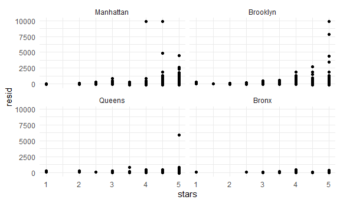

linear models
================

**linear regression lm()** output must be continuous but the predictor
can be any type, if the predictor is categorical, it require indicator
variable(1/0)

betw1: expected change in y for one unit change in x, keeping sex fixed

test statistic: t=(beta\_hat-beta)/se\_hat(beta\_hat) test multiple
coefficients by F test or ANOVA **Generalized linear models: logictic
regression** for non-continuius outcomes

## Import data

``` r
data("nyc_airbnb")
nyc_airbnb = 
  nyc_airbnb %>% 
  mutate(stars = review_scores_location / 2) %>% 
  rename(
    borough = neighbourhood_group,
    neighborhood = neighbourhood) %>% 
  filter(borough != "Staten Island") %>% 
  select(price, stars, borough, neighborhood, room_type)
```

## Fit a model

how the price is related to stars and borough

``` r
nyc_airbnb %>% 
  ggplot(aes(x = stars, y = price, color = borough)) +
  geom_point()
```

    ## Warning: Removed 9962 rows containing missing values (geom_point).


Let’s fit the model we care about.

``` r
#brones are the reference since it in  alphabetical order, 
#  specify an intercept-only model (outcome ~ 1), a model with no intercept (outcome ~ 0 + ...), and a model using all available predictors (outcome ~ .).
fit = lm(price ~ stars + borough, data = nyc_airbnb)
```

Let’s look at the result…

Let’s look at the result better ..

``` r
# both the glance and tudy produce data fram but not list
broom::glance(fit)# a glance of the result
```

    ## # A tibble: 1 x 12
    ##   r.squared adj.r.squared sigma statistic   p.value    df  logLik    AIC    BIC
    ##       <dbl>         <dbl> <dbl>     <dbl>     <dbl> <dbl>   <dbl>  <dbl>  <dbl>
    ## 1    0.0342        0.0341  182.      271. 6.73e-229     4 -2.02e5 4.04e5 4.04e5
    ## # ... with 3 more variables: deviance <dbl>, df.residual <int>, nobs <int>

``` r
broom::tidy(fit) %>% 
  select(-std.error, -statistic) %>% 
  mutate(
    term = str_replace(term, "borough", "Borough: ")
  ) %>% 
  knitr::kable(digits = 3)
```

| term               | estimate | p.value |
| :----------------- | -------: | ------: |
| (Intercept)        | \-70.414 |   0.000 |
| stars              |   31.990 |   0.000 |
| Borough: Brooklyn  |   40.500 |   0.000 |
| Borough: Manhattan |   90.254 |   0.000 |
| Borough: Queens    |   13.206 |   0.145 |

## Be in control of factors

``` r
#the factor level is treated as the reference. 
#it’s important to note that changing reference categories won’t change “fit” or statistical sigificance, but can affect ease of interpretation
nyc_airbnb =
  nyc_airbnb %>% 
  mutate(
    borough = fct_infreq(borough),
    room_type = fct_infreq(room_type)
  )
```

Look at that plot again

``` r
# now borough is in an order of frequency 
# now manhattan is the reference
nyc_airbnb %>% 
  ggplot(aes(x = stars, y = price, color = borough)) + 
  geom_point()
```

    ## Warning: Removed 9962 rows containing missing values (geom_point).


``` r
fit = lm(price ~ stars + borough, data = nyc_airbnb)
broom::tidy(fit)
```

    ## # A tibble: 5 x 5
    ##   term            estimate std.error statistic   p.value
    ##   <chr>              <dbl>     <dbl>     <dbl>     <dbl>
    ## 1 (Intercept)         19.8     12.2       1.63 1.04e-  1
    ## 2 stars               32.0      2.53     12.7  1.27e- 36
    ## 3 boroughBrooklyn    -49.8      2.23    -22.3  6.32e-109
    ## 4 boroughQueens      -77.0      3.73    -20.7  2.58e- 94
    ## 5 boroughBronx       -90.3      8.57    -10.5  6.64e- 26

``` r
broom::glance(fit)
```

    ## # A tibble: 1 x 12
    ##   r.squared adj.r.squared sigma statistic   p.value    df  logLik    AIC    BIC
    ##       <dbl>         <dbl> <dbl>     <dbl>     <dbl> <dbl>   <dbl>  <dbl>  <dbl>
    ## 1    0.0342        0.0341  182.      271. 6.73e-229     4 -2.02e5 4.04e5 4.04e5
    ## # ... with 3 more variables: deviance <dbl>, df.residual <int>, nobs <int>

## Diagnostics

``` r
#add residuals and fitted values to a dataframe.
nyc_airbnb %>% 
  modelr::add_residuals(fit) %>% 
  ggplot(aes(x = borough, y = resid)) + 
  geom_violin() +
  ylim(-500, 1500)
```

    ## Warning: Removed 9993 rows containing non-finite values (stat_ydensity).


``` r
# ylim() can help to zoom in, delet the big outlier :notably the presence of extremely large outliers in price and a generally skewed residual distribution. 


nyc_airbnb %>% 
  modelr::add_residuals(fit) %>% 
  ggplot(aes(x = stars, y = resid)) +
  geom_point() + 
  facet_wrap(. ~ borough)
```

    ## Warning: Removed 9962 rows containing missing values (geom_point).



``` r
# manhattan get wider distribution of residule whe nyou get higher star
# Bronx has small range of residuals in different starts
```

## Hypothesis tests

This does t-test by default

``` r
fit %>% 
  broom::tidy()
```

    ## # A tibble: 5 x 5
    ##   term            estimate std.error statistic   p.value
    ##   <chr>              <dbl>     <dbl>     <dbl>     <dbl>
    ## 1 (Intercept)         19.8     12.2       1.63 1.04e-  1
    ## 2 stars               32.0      2.53     12.7  1.27e- 36
    ## 3 boroughBrooklyn    -49.8      2.23    -22.3  6.32e-109
    ## 4 boroughQueens      -77.0      3.73    -20.7  2.58e- 94
    ## 5 boroughBronx       -90.3      8.57    -10.5  6.64e- 26

what about the significance of `borough`.

``` r
# in the null model the price is unassociated with  stars
# the hypothesis model th price is related to borough
fit_null = lm(price ~ stars, data = nyc_airbnb)
fit_alt = lm(price ~ stars + borough, data = nyc_airbnb)
anova(fit_null, fit_alt) %>% 
  broom::tidy()
```

    ## # A tibble: 2 x 6
    ##   res.df         rss    df     sumsq statistic    p.value
    ##    <dbl>       <dbl> <dbl>     <dbl>     <dbl>      <dbl>
    ## 1  30528 1030861841.    NA       NA        NA  NA        
    ## 2  30525 1005601724.     3 25260117.      256.  7.84e-164

## Nest data, fit models

This is pretty formal and also complex

``` r
# how star affect the price when this borough compared to that borough
#how room_type affect the price when this borough compared to that borough
# in the term column: the 'star' means the the overall effect of stars
# the combination of stars and borough, stars:boroughBrooklyn mean the effect of stars in a different goup
# what is going on in my reference group of mahaten if I want to know waht effect room type 
fit = lm(price ~ stars * borough + room_type * borough, data = nyc_airbnb)
broom::tidy(fit)
```

    ## # A tibble: 16 x 5
    ##    term                                  estimate std.error statistic  p.value
    ##    <chr>                                    <dbl>     <dbl>     <dbl>    <dbl>
    ##  1 (Intercept)                              95.7      19.2     4.99   6.13e- 7
    ##  2 stars                                    27.1       3.96    6.84   8.20e-12
    ##  3 boroughBrooklyn                         -26.1      25.1    -1.04   2.99e- 1
    ##  4 boroughQueens                            -4.12     40.7    -0.101  9.19e- 1
    ##  5 boroughBronx                             -5.63     77.8    -0.0723 9.42e- 1
    ##  6 room_typePrivate room                  -124.        3.00  -41.5    0.      
    ##  7 room_typeShared room                   -154.        8.69  -17.7    1.42e-69
    ##  8 stars:boroughBrooklyn                    -6.14      5.24   -1.17   2.41e- 1
    ##  9 stars:boroughQueens                     -17.5       8.54   -2.04   4.09e- 2
    ## 10 stars:boroughBronx                      -22.7      17.1    -1.33   1.85e- 1
    ## 11 boroughBrooklyn:room_typePrivate room    32.0       4.33    7.39   1.55e-13
    ## 12 boroughQueens:room_typePrivate room      54.9       7.46    7.37   1.81e-13
    ## 13 boroughBronx:room_typePrivate room       71.3      18.0     3.96   7.54e- 5
    ## 14 boroughBrooklyn:room_typeShared room     47.8      13.9     3.44   5.83e- 4
    ## 15 boroughQueens:room_typeShared room       58.7      17.9     3.28   1.05e- 3
    ## 16 boroughBronx:room_typeShared room        83.1      42.5     1.96   5.03e- 2

This is more exploratory but maybe easier to understand.

``` r
# map linear model across data(it is a data frame)
# you will get one column named model that contains 4 linear model fits
# map broom:tidy across model column and get a new column named results that contains 4 lists of data frame
# the lists of data frame can be unnest 
nyc_airbnb %>% 
  nest(data = -borough) %>% # nest everything except borough
  mutate(
    models = map(.x = data, ~lm(price ~ stars + room_type , data = .x)), 
    results = map(models, broom::tidy)
  ) %>% 
  select(-data, -models) %>% 
  unnest(results) %>% 
  filter(term != "(Intercept)") %>% 
  select(borough, term, estimate) %>% 
  pivot_wider(
    names_from = borough, 
    values_from = estimate
  )
```

    ## # A tibble: 3 x 5
    ##   term                   Bronx Queens Brooklyn Manhattan
    ##   <chr>                  <dbl>  <dbl>    <dbl>     <dbl>
    ## 1 stars                   4.45   9.65     21.0      27.1
    ## 2 room_typePrivate room -52.9  -69.3     -92.2    -124. 
    ## 3 room_typeShared room  -70.5  -95.0    -106.     -154.

Let’s nest even more ….

shows neighborhood-specific estimates for the coefficients related to
room type.

``` r
# map(): for each of the models, fit a model that relates price to stars and room_type using the data frame
# the estimate is negative: as stars increase, the price in  chinatown will decrease
nyc_airbnb %>% 
  filter(borough == "Manhattan") %>% 
  nest(data = -neighborhood) %>% 
  mutate(
    models = map(.x = data, ~lm(price ~ stars + room_type , data = .x)), 
    results = map(models, broom::tidy)
  ) %>% 
  select(-data, -models) %>% 
  unnest(results) %>% 
  filter(str_detect(term, "room_type")) %>% 
  ggplot(aes(x = neighborhood, y = estimate)) +
  geom_point() +
  facet_wrap(. ~ term) + 
  theme(axis.text.x = element_text(angle = 70, vjust = 1, hjust = 1))
```


``` r
#map everything against the term
```

the plot above shows that a reduction in room price for a private room
or a shared room compared to an entire apartment, but this varies quite
a bit across neighborhoods.

it really isn’t a good idea to fit models with main effects or
interactions for each. Instead, you’d be best-off using a mixed model,
with random intercepts and slopes for each neighborhood.

manhattan\_airbnb = nyc\_airbnb %\>% filter(borough == “Manhattan”) %\>%
lme4::lmer(price \~ stars + room\_type + (1 + room\_type |
neighborhood), data = .) %\>% broom.mixed::tidy()
